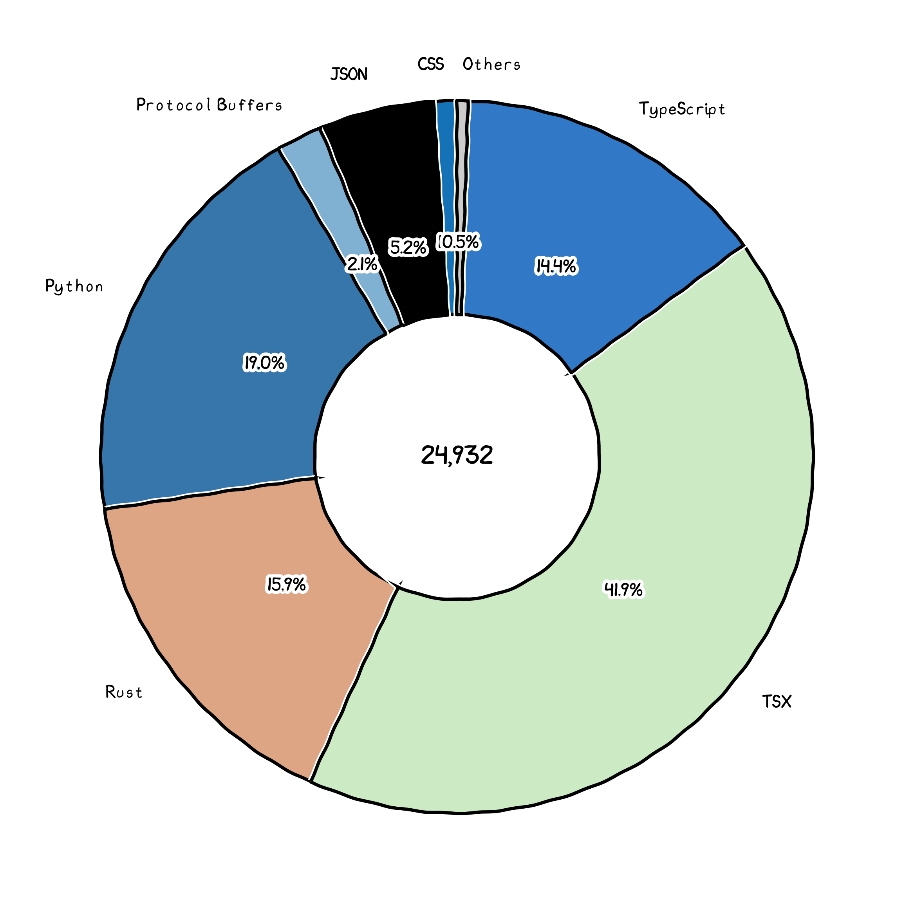

# EVE MultiTools

EVE MultiTools is a comprehensive toolset for EVE Online players, providing market analysis, character management, industry tools, and more.

## Features

- **Market Analysis**: Advanced market data analysis and trading tools
- **Character Management**: Skills, assets, and wallet tracking
- **Industry Tools**: Manufacturing, mining, and research assistance
- **Data Package Management**: Import and manage EVE Online data bundles
- **Multi-language Support**: Chinese and English interface
- **Theme Support**: Light and dark mode themes

## Technologies Used

- [Next.js 14](https://nextjs.org/docs/getting-started)
- [HeroUI v2](https://heroui.com/)
- [Tailwind CSS](https://tailwindcss.com/)
- [Tailwind Variants](https://tailwind-variants.org)
- [TypeScript](https://www.typescriptlang.org/)
- [Framer Motion](https://www.framer.com/motion/)
- [next-themes](https://github.com/pacocoursey/next-themes)

## Development

Before starting development, make sure you have the following items installed:
- pnpm: The frontend part uses pnpm as package manager
- rust toolchain, including cargo: The rust package manager and build tools
- tauri environment: see [tauri.app/start/prerequisites](https://tauri.app/start/prerequisites/) for more information.

### Clone the repository

```bash
git clone https://github.com/your-username/eve-multitools.git
cd eve-multitools
```

### Install dependencies

```bash
pnpm install
```

### Run the development application

```bash
pnpm tauri dev
```

### Build release version

```bash
pnpm tauri build
```

### More guides

[Guides](./docs/README.md)

## License

This project is licensed under the [MIT License](LICENSE-MIT)
and the [Apache-v2.0 License](LICENSE-APACHE).

## Code Graph


